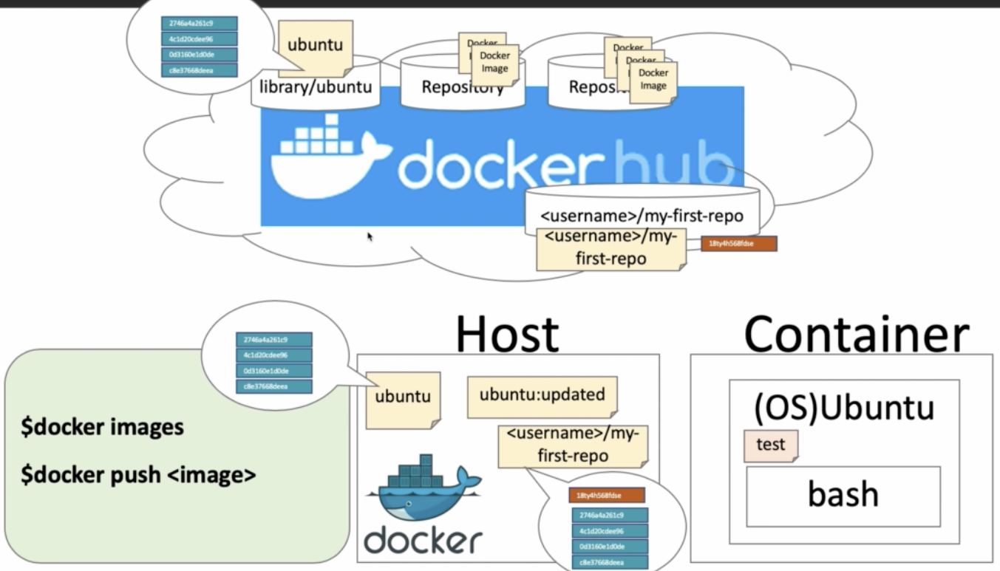
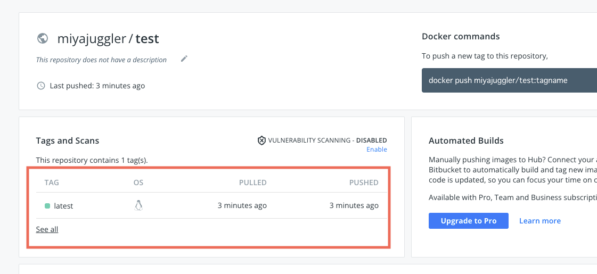
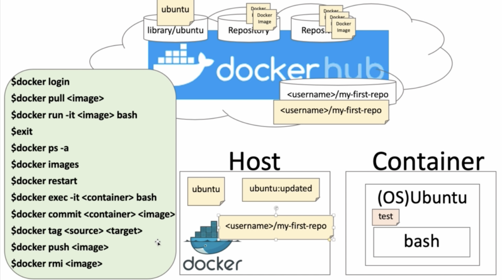

# 04

## `dockerhub` から image を pull

### コマンド

```
$ docker login

$ docker pull <image>

$ docker images
```

### ログイン

```
docker login
```

ユーザーネームとパスワードを聞かれるので記入

### hello-world を pull する

```
$ docker pull hello-world
```

<details>

```
$ docker pull hello-world
Using default tag: latest
latest: Pulling from library/hello-world
93288797bd35: Pull complete
Digest: sha256:975f4b14f326b05db86e16de00144f9c12257553bba9484fed41f9b6f2257800
Status: Downloaded newer image for hello-world:latest
docker.io/library/hello-world:latest
```

</details>

### 確認

`docker image` だけだと全件取得してくる。

もしローカルにたくさん image がある場合、`hello-world` をつけてフィルタリングする。

```
$ docker images hello-world
REPOSITORY      TAG         IMAGE ID       CREATED         SIZE
hello-world     latest      18e5af790473   3 months ago    9.14kB
```

`REPOSITORY` はリポジトリの名前。

`TAG` は image のバージョンみたいなもの。指定しないと latest をとってくる

まとめると、今回は `library/hello-world` というリポジトリから `latest` というタグの image をとってきた

[dockerhub-library](https://hub.docker.com/u/library)

[hello-world](https://hub.docker.com/_/hello-world)

## image からコンテナ作成

### コマンド

```
$ docker run <image>

$ docker ps -a
```

`hello-world` の `image` を起動

```
$ docker run hello-world
```

<details>

```
$ docker run hello-world

Hello from Docker!
This message shows that your installation appears to be working correctly.

To generate this message, Docker took the following steps:
 1. The Docker client contacted the Docker daemon.
 2. The Docker daemon pulled the "hello-world" image from the Docker Hub.
    (arm64v8)
 3. The Docker daemon created a new container from that image which runs the
    executable that produces the output you are currently reading.
 4. The Docker daemon streamed that output to the Docker client, which sent it
    to your terminal.

To try something more ambitious, you can run an Ubuntu container with:
 $ docker run -it ubuntu bash

Share images, automate workflows, and more with a free Docker ID:
 https://hub.docker.com/

For more examples and ideas, visit:
 https://docs.docker.com/get-started/
```

</details>

### 確認

`docker ps` だと稼働中のコンテナを全件取得してくる。  
`docker ps -a` だと終了したコンテナも含めて全件取得してくる。

もしローカル環境にたくさんのコンテナがある場合は、以下のようなコマンドでフィルタリングする。

```
$ docker ps -a -f "ancestor=hello-world"
CONTAINER ID  IMAGE        COMMAND   CREATED         STATUS  PORTS     NAMES
dff3f6a0f582  hello-world  "/hello"  12 minutes ago  Exited (0) 12 minutes ago            friendly_wright
```

`hello-world` にはテキストを出力するプログラムが入ってるらしい。  
`docker run` をすることで `hello-world` の image からコンテナが作られて、テキスト出力が実行されて、exit した感じ。

## `ubuntu` の image を run する

### `docker run -it ubuntu bash` 実行

```
$ docker run -it ubuntu bash
```

`bash` をつけることで、コンテナ起動時の実行プログラムを指定することができる。  
ということでコマンドを打って実行してみる。

ローカルに run したい image がない場合、勝手に pull してくれる。

```
$ docker run -it ubuntu bash
Unable to find image 'ubuntu:latest' locally
latest: Pulling from library/ubuntu
5f3d23ccb99f: Pull complete
Digest: sha256:b5a61709a9a44284d88fb12e5c48db0409cfad5b69d4ff8224077c57302df9cf
Status: Downloaded newer image for ubuntu:latest
root@f670ad3a6d8b:/#
```

`docker run` したことにより コンテナの中に入った。

プロンプトを見ると `root@f670ad3a6d8b:/#` このようになっており、コンテナ ID が付いている。
ちなみに root はルートユーザーのこと

### 確認

```
root@f670ad3a6d8b:/# pwd
/

docker ps -a
CONTAINER ID   IMAGE    COMMAND  CREATED          STATUS       PORTS    NAMES
f670ad3a6d8b   ubuntu   "bash"   5 minutes ago    Up 5 minutes          ecstatic_morse
```

ls を打ってみる。

```
root@f670ad3a6d8b:/# ls
bin  boot  dev  etc  home  lib  media  mnt  opt  proc  root  run  sbin  srv  sys  tmp  usr  var
```

このようにコンテナ内にあるフォルダが見て取れる。  
ホストにはないフォルダだらけなので間違いなくコンテナの中にいることがわかる。

ホストとコンテナどちらにいるのかを意識すること

## コンテナを更新して image を更新する

docker image を作る方法は実は 2 つある。

1. docker file から更新する
2. コンテナを更新して image を作る

今回は 1 つ目のやり方で image を更新する。

### 手順

1. `touch test` で test ファイルを作成
2. `exit` でコンテナから出る

### 実行内容

```
root@f670ad3a6d8b:/# touch test
root@f670ad3a6d8b:/# ls
bin  boot  dev  etc  home  lib  media  mnt  opt  proc  root  run  sbin  srv  sys  test  tmp  usr  var
root@f670ad3a6d8b:/# exit
exit
~/github/docker-practice main ❯
```

Exited になっている

```
$ docker ps -a
CONTAINER ID   IMAGE    COMMAND   CREATED             STATUS   PORTS   NAMES
f670ad3a6d8b   ubuntu   "bash"    About an hour ago   Exited (0) 25 minutes ago           ecstatic_morse
```

## docker コンテナを起動し、その中に入る。 exit 以外の方法で抜ける。

### コマンド

```sh
$ docker exec -it <container> bash
$ docker attach <container>
  ctrl+p+q
```

```
docker ps -a
CONTAINER ID   IMAGE     COMMAND    CREATED         STATUS PORTS   NAMES
f670ad3a6d8b   ubuntu    "bash"     24 hours ago    Exited (0) 23 hours ago           ecstatic_morse
```

```sh
$ docker start f670ad3a6d8b
f670ad3a6d8b

$ docker ps -a
CONTAINER ID   IMAGE      COMMAND   CREATED        STATUS       PORTS    NAMES
f670ad3a6d8b   ubuntu     "bash"    24 hours ago   Up 3 seconds          ecstatic_morse
```

```sh
# image を取得してきて中に入るコマンド
$ docker run -it <image> bash

# すでにあるコンテナの中に入るコマンド
$ docker exec -it <container> bash
```

```
$ docker exec -it f670ad3a6d8b bash
root@f670ad3a6d8b:/# ls
bin  boot  dev  etc  home  lib  media  mnt  opt  proc  root  run  sbin  srv  sys  test  tmp  usr  var
```

ctrl+p+q

```
root@f670ad3a6d8b:/# read escape sequence
$ docker ps -a

CONTAINER ID   IMAGE    COMMAND   CREATED        STATUS          PORTS   NAMES
f670ad3a6d8b   ubuntu   "bash"    24 hours ago   Up 19 minutes           ecstatic_morse
```

- exec 元のプロセスは切ってコンテナから出る。
- ctrl+p+q 元のプロセスは残ったまま、かつコンテナは up のまま

再度コンテナに入るには `attach` を使う

```
docker attach f670ad3a6d8b
root@f670ad3a6d8b:/#
```

基本は exit が基本みたい。なにかプロセスを残したままコンテナから出たい場合のみ dettach を使う。  
「attach 後に exit するとコンテナは停止する」「exec では exit しても停止しない」

## commit して更新内容を image にする

### コマンド

```
docker commit <container> <new image>
```

`<new image>` のとこは `repository` : `tag`

```
$ docker commit f670ad3a6d8b ubuntu:updated
sha256:fc639a90e9ee0376f188daba045c44db5100af990001defe51599f509310bf1e

$ docker images
REPOSITORY    TAG        IMAGE ID       CREATED          SIZE
ubuntu        updated    fc639a90e9ee   16 seconds ago   65.6MB
ubuntu        latest     9f4877540c73   12 days ago      65.6MB
```

## dockerhub にリポジトリを作成する

`Create Repository` => `Name(Repository名)` を記入 => Create

Image 名 … `Repository名:Tag名`

※ Repository 名を Image 名と指すときもある

(例) ubuntu …`library/ubuntu:latest`

## image の名前を Repository 名に合わせて別名で保存する。

### コマンド

```
$ docker tag <source name> <target name>
```

```
$ docker tag ubuntu:updated <username>/test
```

```
$ docker images
REPOSITORY          TAG        IMAGE ID       CREATED          SIZE
ubuntu              updated    fc639a90e9ee   33 minutes ago   65.6MB

$ docker tag ubuntu:updated miyajuggler/test

$ docker images
REPOSITORY          TAG        IMAGE ID       CREATED          SIZE
ubuntu              updated    fc639a90e9ee   34 minutes ago   65.6MB
miyajuggler/test    latest     fc639a90e9ee   34 minutes ago   65.6MB
```

tag 名は指定しなかったので latest となっている。

また、こうしてみると `ubuntu` と `miyajugler/test` は同じ ID になっている。
同じ docker image に複数の tag(名前)がつけられていると考えて良い。

## dockerhub に image を push する

## コマンド

```
$ docker push <image>
```

```
$ docker push miyajuggler/test
Using default tag: latest
The push refers to repository [docker.io/miyajuggler/test]
a8b945e8636c: Pushed
5893b75bac23: Mounted from library/ubuntu
latest: digest: sha256:2fd8145d2109ec26f715e7166d855609b43ce399b55286d7fd8b0ea723847c45 size: 736
```

image レイヤーのあたらしいものだけ push されている。  
Mounted となってるのは使い回しというかそういうものというか。  
dockerhub にある ubuntu の image を共有している。

|
|:-:|

|
|:-:|

## dockerhub から push した docker image を pull してみる

### コマンド

```sh
$ docker rmi <image>

$ docker pull <image>

$ docker run -it <image> bash
```

まずは対象の image を削除 （あると pull がうまくいかない）

```sh
$ docker rmi miyajuggler/test
Untagged: miyajuggler/test:latest
Untagged: miyajuggler/test@sha256:2fd8145d2109ec26f715e7166d855609b43ce399b55286d7fd8b0ea723847c45
```

`docker images` で確認すると、たしかに `miyajuggler/test` の image はなくなっている。

次に dockerhub にある対象の image を pull してくる。

```
$ docker pull miyajuggler/test
Using default tag: latest
latest: Pulling from miyajuggler/test
Digest: sha256:2fd8145d2109ec26f715e7166d855609b43ce399b55286d7fd8b0ea723847c45
Status: Downloaded newer image for miyajuggler/test:latest
docker.io/miyajuggler/test:latest
```

確認すると `miyajuggler/test` の image がある。ちなみに image ID も変わってないことが確認できる。

```
docker images
REPOSITORY         TAG         IMAGE ID       CREATED       SIZE
miyajuggler/test   latest      fc639a90e9ee   2 weeks ago   65.6MB
```

コンテナを立てて、その中に入ってみると test というフォルダが有ることがわかる。

```
docker run -it miyajuggler/test bash
root@2e7229b46373:/# ls
bin  boot  dev  etc  home  lib  media  mnt  opt  proc  root  run  sbin  srv  sys  test  tmp  usr  var
```

docker image にはタグが付けられる（バージョンみたいなもの）

## まとめ

|
|:-:|
