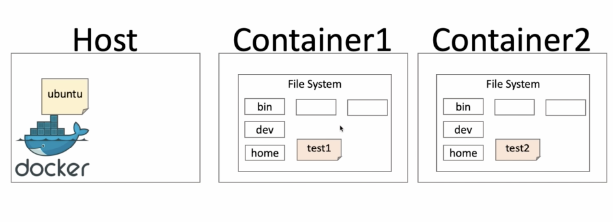
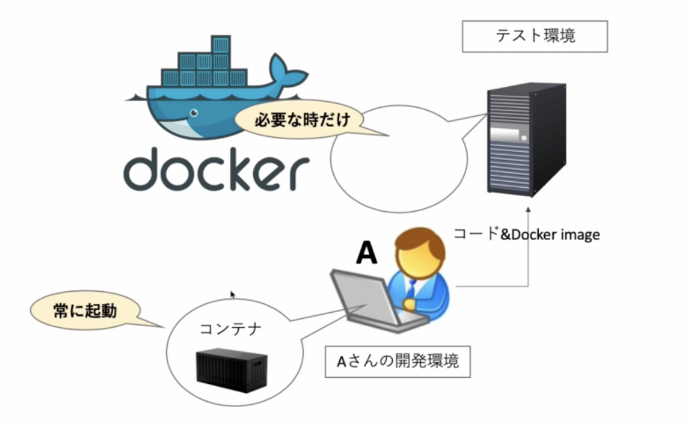
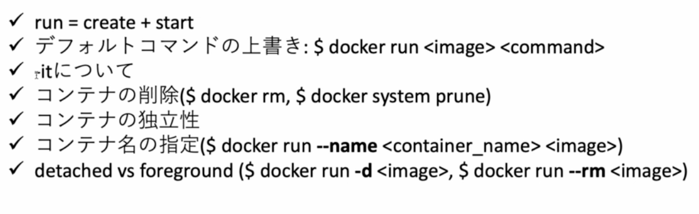

# 05

## docker run とは

### run = create + start という認識

### もう一度、`docker run` が何をやっているのかを確認

```
$ docker run hello-world

Hello from Docker!
This message shows...
```

このコマンドで、hello-world の image からコンテナを立てて、デフォルトコマンドを出力した。

```
$ docker ps -a
CONTAINER ID   IMAGE          COMMAND    CREATED          STATUS      PORTS   NAMES
11ae01faec57   hello-world    "/hello"   2 minutes ago    Exited (0) 2 minutes ago           dreamy_antonelli
```

status は exit

### docker create <image> を確認

```
$ docker create hello-world
af909cd13b3523bdbda6491200c646f86af87b3d23acab7dcaa9577303a06086

$ docker ps -a
CONTAINER ID   IMAGE         COMMAND    CREATED         STATUS    PORTS   NAMES
af909cd13b35   hello-world   "/hello"   4 seconds ago   Created           loving_mclaren
```

af909cd13b35 で始まる container id のコンテナが作られただけ。status も created

### docker start <container>

```
$ docker start af909cd13b35
af909cd13b35

$ docker ps -a
CONTAINER ID   IMAGE          COMMAND   CREATED          STATUS       PORTS    NAMES
af909cd13b35   hello-world    "/hello"  4 minutes ago    Exited (0) 1 second ago            loving_mclaren
```

裏では status は up になってからデフォルトコマンドが実行されて exit になった。
デフォルトコマンドの出力結果を見るためには `-a` のオプションが必要。(業務ではこんなコマンド使わない)

```
$ docker start af909cd13b35 -a

Hello from Docker!
This message shows...
```

ちなみに `COMMAND` がデフォルトのコマンド
これは上書きできる。

ただ、hello-world の image には Ubuntu とか入ってないので bash とかは使えない。
エラーメッセージもそんな漢字のことが書いてある。

```sh
$ docker run -it hello-world bash
docker: Error response from daemon: OCI runtime create failed: container_linux.go:380: starting container process caused: exec: "bash": executable file not found in $PATH: unknown.

# 一応コンテナはたてられている。
$ docker ps -a
CONTAINER ID   IMAGE          COMMAND   CREATED        STATUS   PORTS    NAMES
a172a1ec8593   hello-world    "bash"    4 minutes ago  Created           great_dijkstra
```

上書きに対しては以下へ。

## コマンドの上書き

```
docker rum <image> <command>
```

```sh
$ docker run ubuntu
# 何も起きない

$ docker ps -a
CONTAINER ID   IMAGE       COMMAND     CREATED          STATUS                  PORTS   NAMES
b03201962bdb   ubuntu      "bash"      40 seconds ago   Exited (0) 39 seconds           agobeautiful_solomon
```

`docker run` により、image からコンテナが create され、そのコンテナを start して、勝手に exit した
実は `-it` のオプションにより、bash を実行した状態のままにできる。

コンテナの中でコマンドを実行した出力結果を確認してみる。

```
$ docker run -it ubuntu
root@3e4e98ce8891:/# ls
bin  boot  dev  etc  home  lib  media  mnt  opt  proc  root  run  sbin  srv  sys  tmp  usr  var
root@3e4e98ce8891:/# pwd
/
root@3e4e98ce8891:/# exit
exit
```

コマンドの上書きをしてみる。
すると、上のやつほどきれいにはならなかったが、コマンドが実行され出力された。

```
docker run ubuntu ls
bin
boot
dev
etc
home
lib
media
mnt
opt
proc
root
run
sbin
srv
sys
tmp
usr
var

$ docker run ubuntu pwd
/
```

## `-it` について

正直覚えなくていい

```
-i : インプット可能
-t : 表示が可能
```

-i を抜いて run してみる

```
docker run -t ubuntu bash
root@666113c7c1e1:/# ls

```

何も帰ってこない

ホストからコンテナにチャネルが開いてないため、コマンドがコンテナに反映されてない。ゆえにコマンドの出力結果が帰ってきていない。

-t を抜いて run してみる

```
$ docker run -i ubuntu bash
ls
bin
boot
dev
etc
home
lib
media
mnt
opt
proc
root
run
sbin
srv
sys
tmp
usr
var

```

表示がきれいじゃない。
ちなみにタブ押下による補完もできない

## コンテナの削除

### コマンド

```sh
# 複数指定もできる

# コンテナの削除(status が UP のものは削除できない)
$ docker rm <container>

# コンテナ停止
$ docker stop <container>

# コンテナ全削除(status が UP のもの以外を全削除)
$ docker system prune
```

```
$ docker system prune
WARNING! This will remove:
  - all stopped containers
  - all networks not used by at least one container
  - all dangling images
  - all dangling build cache

Are you sure you want to continue? [y/N]
```

## コンテナのファイルシステムの独立性

container1 からは container2 の test2 ファイルは見えないし、container2 からは container1 の test1 ファイルは見えないし、Host ともファイルシステムは異なっていて独立している。

|
|:-:|

## コンテナに名前をつける

```
$ docker run --name <name> <image>
```

- 起動させ続けるコンテナを建てるとき
- 共有サーバーを使うとき
- 他のプログラムで使用するとき

|
|:-:|

必要なときだけなら名前はいらないが、自分の PC の環境で開発するときに使うときは常に起動しているはずなので、名前つけておくのが吉

大きなサーバー使うとき（クラウドとかにあるやつ）は共有する事が多い。

名前をつけてみる

```
$ docker run --name sample ubuntu
$ docker ps -a
CONTAINER ID   IMAGE    COMMAND  CREATED         STATUS                   PORTS     NAMES
3bf64596c10d   ubuntu   "bash"   2 seconds ago   Exited (0) 1 second ago            sample
```

名前を指定しないと変な名前が付いちゃう。

```
$ docker run ubuntu
$ docker ps -a
CONTAINER ID   IMAGE      COMMAND    CREATEDSTATUS                                   PORTS   NAMES
4d76603a1c13   ubuntu     "bash"     2 seconds ago        Exited (0) 1 second ago            bold_chandrasekhar
3bf64596c10d   ubuntu     "bash"     About a minute ago   Exited (0) About a minute ago      sample
```

同じ名前のコンテナは作れない。

```
$ docker run --name sample ubuntu
docker: Error response from daemon: Conflict. The container name "/sample" is already in use by container "3bf64596c10dba2335afe91d454563c04e86e9c1547e24395c1099f65eef1044". You have to remove (or rename) that container to be able to reuse that name.
See 'docker run --help'.
```

## detached モードと foreground モード

### detached mode

`$ docker run -d <image>`  
コンテナを起動後に detach してホストに戻る （バックグラウンドで動かしたいときに使う）

### foreground mode

コンテナの中に入ったり、コンテナを作ってすぐ捨てたりするようなモード

`$ docker run -rm <image>`  
コンテナを exit 後に削除する

-d をつけてコンテナを起動してみる。  
すると status が up になってコンテナからは抜けていることがわかる。  
バックグラウンドで常に動かしておきたいときは、-d をつけると良い

```
$ docker run -it -d ubuntu bash
e61f6b0aa8db766e3e520ecbdbf512bf61eabe1ab878fbf1d176dfc1f104794c
$ docker ps -a
CONTAINER ID   IMAGE    COMMAND  CREATED          STATUS          PORTS     NAMES
e61f6b0aa8db   ubuntu   "bash"   8 seconds ago    Up 7 seconds              blissful_lamport
```

-rm をつけるとコンテナが exit 後に削除される。

```sh
$ docker run --rm hello-world
# テキスト出力がされ、コンテナは削除されている。

$ docker run -it --rm ubuntu bash
# コンテナに入って exit 後にはコンテナは消えている
```

## まとめ

|
|:-:|
