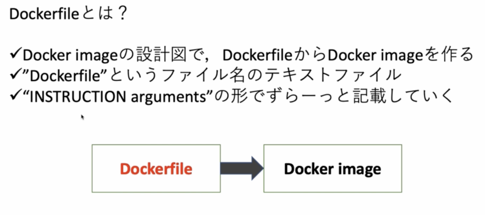
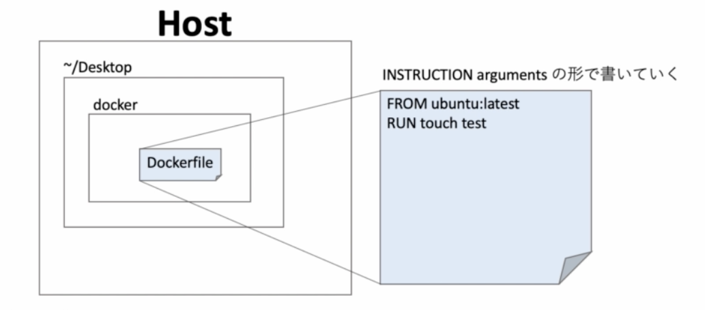
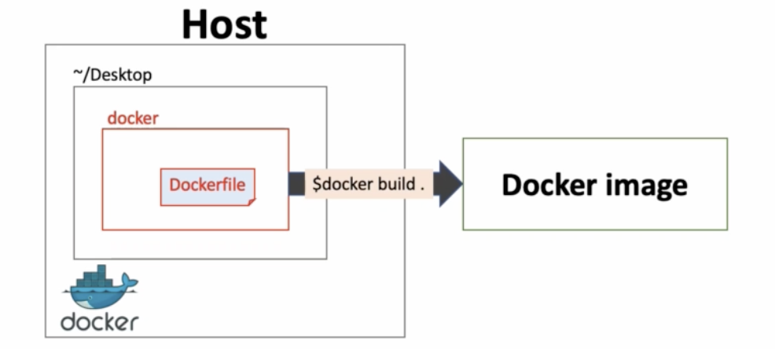
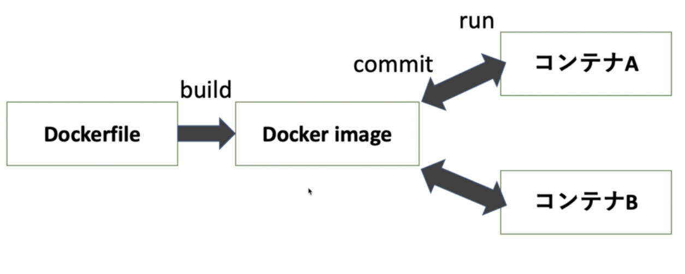

# 06. Dockerfile を知る

## Dockerfile

Dockerfile : docker image の設計図みたいなもの

テキストファイルで書かれており、どういう image になるのかわかりやすい。可視化されている。  
そのため Dockerfile を作ってそこから image を作るパターンが多い。(コンテナから commit して image を更新するパターンは image の中身がわからないため、少ないらしい)

|
|:-:|

## Dockerfile 作成

|
|:-:|

```sh
# フォルダ名は何でもいい
$ mkdir docker
$ cd docker
# Dockerfile という名前でなければならない
$ touch Dockerfile
```

### Dockerfile の中身

```Dockerfile
FROM ubuntu:latest
RUN touch test
```

`ubuntu:latest` という image を取ってきて、そのコンテナの中で `touch test` というコマンドを行う

## docker build

`docker build` することで Dockerfile から image ができる。

|
|:-:|

### コマンド

```sh
# 基本的には Dockerfile のあるディレクトリに移動してから build する
$ docker build <directory>

# 名前をつけたいときは -t をつける
$ docker build -t <name> <directory>
```

```sh
# docker フォルダに移動してから
$ docker build .
```

### 実行

```
$ docker build .
[+] Building 5.2s (7/7) FINISHED
 => [internal] load build definition from Dockerfile
 => => transferring dockerfile: 105B
 => [internal] load .dockerignore
 => => transferring context: 2B
 => [internal] load metadata for docker.io/library/ubuntu:latest
 => [auth] library/ubuntu:pull token for registry-1.docker.io
 => [1/2] FROM docker.io/library/ubuntu:latest@sha256:669e010b58baf5beb2836b253c1fd5768333f0d1dbcb834f7c07a4dc93f474be
 => => resolve docker.io/library/ubuntu:latest@sha256:669e010b58baf5beb2836b253c1fd5768333f0d1dbcb834f7c07a4dc93f474be
 => => sha256:bbf2fb66fa6e06dd46eb26f518f93171ee7c48be68aafb213aa7c2c12f4018ca 27.17MB / 27.17MB
 => => sha256:669e010b58baf5beb2836b253c1fd5768333f0d1dbcb834f7c07a4dc93f474be 1.42kB / 1.42kB
 => => sha256:13572ca2bcc043618c2c2ab6ee7dda8ede63ff782a604f58e69c6e7dac62b626 529B / 529B
 => => sha256:a457a74c9aaabc62ddc119d2fb03ba6f58fa299bf766bd2411c159142b972c1d 1.48kB / 1.48kB
 => => extracting sha256:bbf2fb66fa6e06dd46eb26f518f93171ee7c48be68aafb213aa7c2c12f4018ca
 => [2/2] RUN touch test
 => exporting to image
 => => exporting layers
 => => writing image sha256:6264619f81c59c8cbaa59476bfeee31b95390c4d832dd9867e9507a406d77362

Use 'docker scan' to run Snyk tests against images to find vulnerabilities and learn how to fix them
```

確認

```sh
$ docker images
REPOSITORY      TAG        IMAGE ID       CREATED         SIZE
<none>          <none>     6264619f81c5   3 minutes ago   65.6MB

# dangling images
$ docker images -f dangling=true
REPOSITORY   TAG       IMAGE ID       CREATED         SIZE
<none>       <none>    6264619f81c5   4 minutes ago   65.6MB
```

タグを持たず、他のコンテナからも参照されないイメージ（dangling）

### 名前指定で build

```
$ docker build -t new-ubuntu:latest .
[+] Building 1.8s (7/7) FINISHED
 => [internal] load build definition from Dockerfile
 => => transferring dockerfile: 36B
 => [internal] load .dockerignore
 => => transferring context: 2B
 => [internal] load metadata for docker.io/library/ubuntu:latest
 => [auth] library/ubuntu:pull token for registry-1.docker.io
 => [1/2] FROM docker.io/library/ubuntu:latest@sha256:669e010b58baf5beb2836b253c1fd5768333f0d1dbcb834f7c07a4dc93f474be
 => CACHED [2/2] RUN touch test
 => exporting to image
 => => exporting layers
 => => writing image sha256:6264619f81c59c8cbaa59476bfeee31b95390c4d832dd9867e9507a406d77362
 => => naming to docker.io/library/new-ubuntu:latest

Use 'docker scan' to run Snyk tests against images to find vulnerabilities and learn how to fix them
```

確認

```
$ docker images
REPOSITORY     TAG      IMAGE ID       CREATED         SIZE
new-ubuntu     latest   6264619f81c5   7 minutes ago   65.6MB
```

## docker image を run して確認してみる

### 実行

test ファイルが有ることが確認

```
# new-ubuntu:latest, new-ubuntu, 6264619f81c5 のどれでもいい
$ docker run -it new-ubuntu:latest bash
root@61d0d0286120:/# ls
bin  boot  dev  etc  home  lib  media  mnt  opt  proc  root  run  sbin  srv  sys  test  tmp  usr  var
```

|
|:-:|

一般的に、コンテナから commit して image を調整するのと同時に Dockerfile もメンテしていく。
