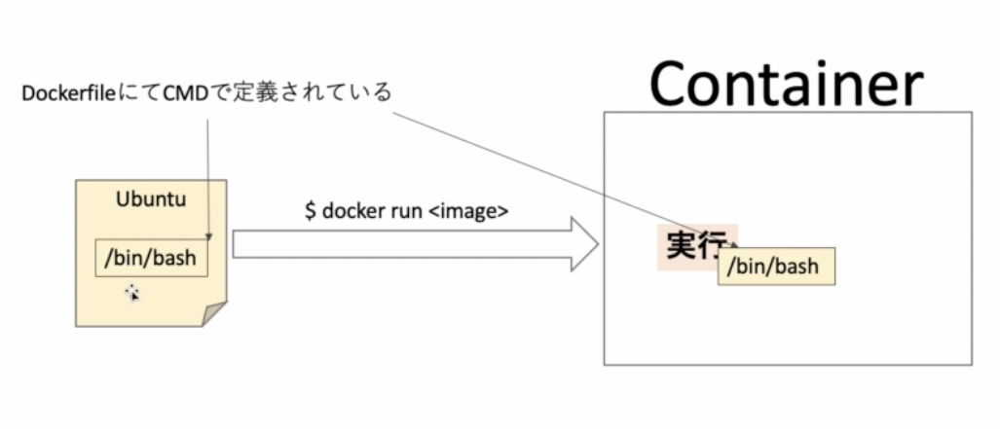

# 07. Dockerfile の書き方と基本

## FROM

|
|:-:|

FROM は image を取ってくるもの。

この取ってきた image に対して、RUN でいろいろカスタマイズしていく感じ

```
$ docker build -t new-ubuntu:latest .
[+] Building 1.8s (7/7) FINISHED
 => [internal] load build definition from Dockerfile
 => => transferring dockerfile: 36B
 => [internal] load .dockerignore
 => => transferring context: 2B
 => [internal] load metadata for docker.io/library/ubuntu:latest
 => [auth] library/ubuntu:pull token for registry-1.docker.io
 => [1/2] FROM docker.io/library/ubuntu:latest@sha256:669e010b58baf5beb2836b253c1fd5768333f0d1dbcb834f7c07a4dc93f474be <= ubuntu の image そのもの
 => CACHED [2/2] RUN touch test
 => exporting to image
 => => exporting layers
 => => writing image sha256:6264619f81c59c8cbaa59476bfeee31b95390c4d832dd9867e9507a406d77362 <= RUN touch test というレイヤーが追加されていく
 => => naming to docker.io/library/new-ubuntu:latest

Use 'docker scan' to run Snyk tests against images to find vulnerabilities and learn how to fix them
```

## RUN

取ってきた image に対して、RUN でいろいろカスタマイズしていく感じ

|
|:-:|

ubuntu の image に対して、`touch test` という linux コマンドが実行されていく、という感じ。

```Dockerfile
FROM ubuntu:latest
RUN touch test
RUN echo 'hello world' > test
```

```
$ docker build .
[+] Building 2.2s (8/8) FINISHED
 => [internal] load build definition from Dockerfile
 => => transferring dockerfile: 135B
 => [internal] load .dockerignore
 => => transferring context: 2B
 => [internal] load metadata for docker.io/library/ubuntu:latest
 => [auth] library/ubuntu:pull token for registry-1.docker.io
 => [1/3] FROM docker.io/library/ubuntu:latest@sha256:669e010b58baf5beb2836b253c1fd5768333f0d1dbcb834f7c07a4dc93f474be
 => CACHED [2/3] RUN touch test
 => [3/3] RUN echo 'hello-world' > test
 => exporting to image
 => => exporting layers
 => => writing image sha256:6be5d653371b02f10f1663eb9f14b2972eae92bdcc4d5e8359e23f68aa959d41

Use 'docker scan' to run Snyk tests against images to find vulnerabilities and learn how to fix them
```

RUN のひとつひとつに対して image レイヤーが作られている。

|
|:-:|

### 確認

```
$ docker run -it 6be5d653371b bash
root@07a54d583cc2:/# ls
bin  boot  dev  etc  home  lib  media  mnt  opt  proc  root  run  sbin  srv  sys  test  tmp  usr  var
root@07a54d583cc2:/# cat test
hello world
```

RUN でやりたいことというのを記述していく。  
しかしそうするとレイヤーがたくさん作られてしまい、image が重くなってしまう。

そのためなるべく最小数にするために工夫が必要である。それについては以下から記載。

## layer 数を最小にするために

RUN がレイヤーを作ってしまう悪の根源らしい（COPY や ADD はそうでもないらしい）
|
|:-:|

package を最初にインストールしたい。  
ubuntu で package をダウンロードするには apt-get (apt) を使う

|
|:-:|

## cache

0 から build するのを避ける方法。
同じ処理の部分は cache を使えば時短ができる。

### 実践

以下の様な Dockerfile を準備する。

```Dockerfile
FROM ubuntu:latest
RUN apt-get update && apt-get install -y \
    curl \
    nginx
```

実行すると、結構インストールに時間がかかる。

```sh
$ docker build .
[+] Building 22.2s (7/7) FINISHED
 => [internal] load build definition from Dockerfile
 => => transferring dockerfile: 125B
 => [internal] load .dockerignore
 => => transferring context: 2B
 => [internal] load metadata for docker.io/library/ubuntu:latest
 => [auth] library/ubuntu:pull token for registry-1.docker.io
 => CACHED [1/2] FROM docker.io/library/ubuntu:latest@sha256:669e010b58baf5beb2836b253c1fd5768333f0d1dbcb834f7c07a4dc93f474be
 => [2/2] RUN apt-get update && apt-get install -y     curl     nginx
 => exporting to image
 => => exporting layers
 => => writing image sha256:f00e33800f93080aeb94785ed077c3e843142050404cca39f26ecc6a16bdbbb5
```

変更を加える。

```Dockerfile
FROM ubuntu:latest
RUN apt-get update && apt-get install -y \
    curl \
    cvs \
    nginx
```

実行すると、またイチからアップデートとインストールしちゃう。

```sh
$ docker build .
[+] Building 20.2s (6/6) FINISHED
 => [internal] load build definition from Dockerfile
 => => transferring dockerfile: 135B
 => [internal] load .dockerignore
 => => transferring context: 2B
 => [internal] load metadata for docker.io/library/ubuntu:latest
 => CACHED [1/2] FROM docker.io/library/ubuntu:latest@sha256:669e010b58baf5beb2836b253c1fd5768333f0d1dbcb834f7c07a4dc93f474be
 => [2/2] RUN apt-get update && apt-get install -y     curl     cvs     nginx
 => exporting to image
 => => exporting layers
 => => writing image sha256:f0b7433b1b93dc88ed711fa6a752253803afe6b7cd50880b2111501da0bca303

Use 'docker scan' to run Snyk tests against images to find vulnerabilities and learn how to fix them
```

今はインストールするものが 3 つだけなのでマシだが、増えていくと build するだけでめちゃくちゃ待たされることになる。

これを回避するために cache を使用する。

```Dockerfile
FROM ubuntu:latest
RUN apt-get update
RUN apt-get install -y \
    curl \
    nginx
RUN apt-get install -y cvs
```

こんな感じでやれば、アップデートと curl と nginx のインストールは済んでいるためキャッシュを使えるので時短になる。

Dockerfile を構築していくときには cache を用いて時短を行いたいため RUN を複数行で書く。
最終的に完成することがわかったあとに 130 行目のような形（layer が最小数になるような書き方）にもっていくのが良い。

### 実践 2

この形で docker build してから

```Dockerfile
FROM ubuntu:latest
RUN apt-get update
RUN apt-get install -y \
    curl \
    nginx
```

一行加えて再び docker build してみる。

```Dockerfile
FROM ubuntu:latest
RUN apt-get update
RUN apt-get install -y \
    curl \
    nginx
RUN apt-get install -y cvs
```

すると、5 秒で終わった。

```sh
$ docker build .
[+] Building 5.0s (8/8) FINISHED
 => [internal] load build definition from Dockerfile
 => => transferring dockerfile: 154B
 => [internal] load .dockerignore
 => => transferring context: 2B
 => [internal] load metadata for docker.io/library/ubuntu:latest
 => [1/4] FROM docker.io/library/ubuntu:latest@sha256:669e010b58baf5beb2836b253c1fd5768333f0d1dbcb834f7c07a4dc93f474be
 => CACHED [2/4] RUN apt-get update
 => CACHED [3/4] RUN apt-get install -y     curl     nginx
 => [4/4] RUN apt-get install -y cvs
 => exporting to image
 => => exporting layers
 => => writing image sha256:645f4c0d6371c3ba7be0f93c029eed6b62ea6a9cbda0fa246fe2f006bf119def
Use 'docker scan' to run Snyk tests against images to find vulnerabilities and learn how to fix them
```

CACHED という項目から、`RUN apt-get update` `RUN apt-get install -y curl nginx` の部分は cache が使われているのがわかる。
これにより `RUN apt-get install -y cvs` のみがインストール作業がおこなわれている。

# CMD

|
|:-:|
