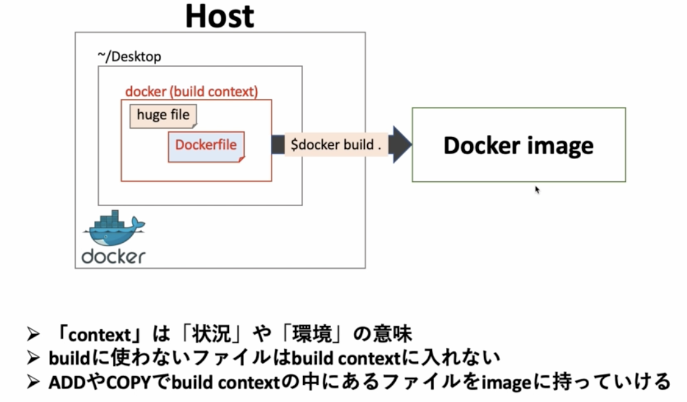
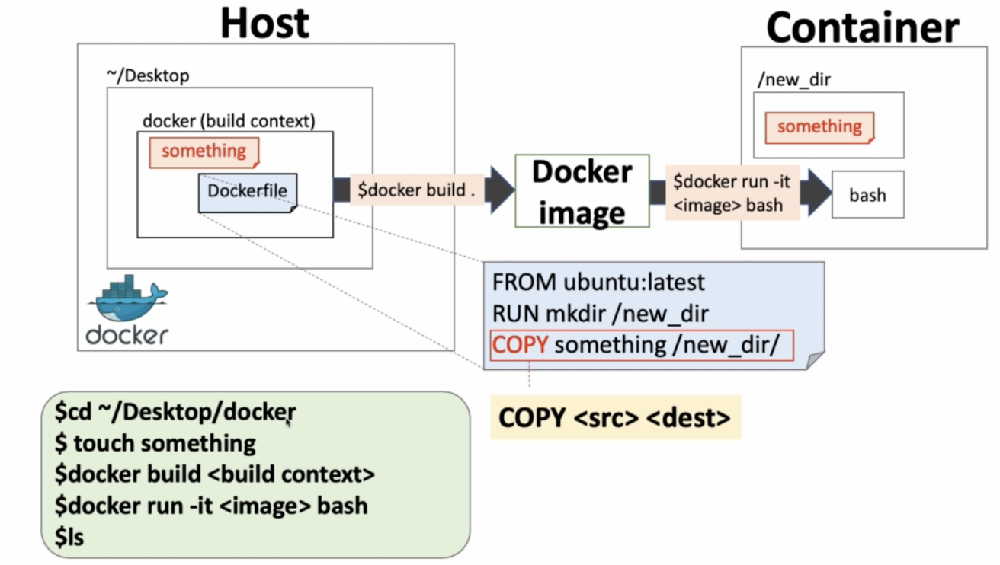
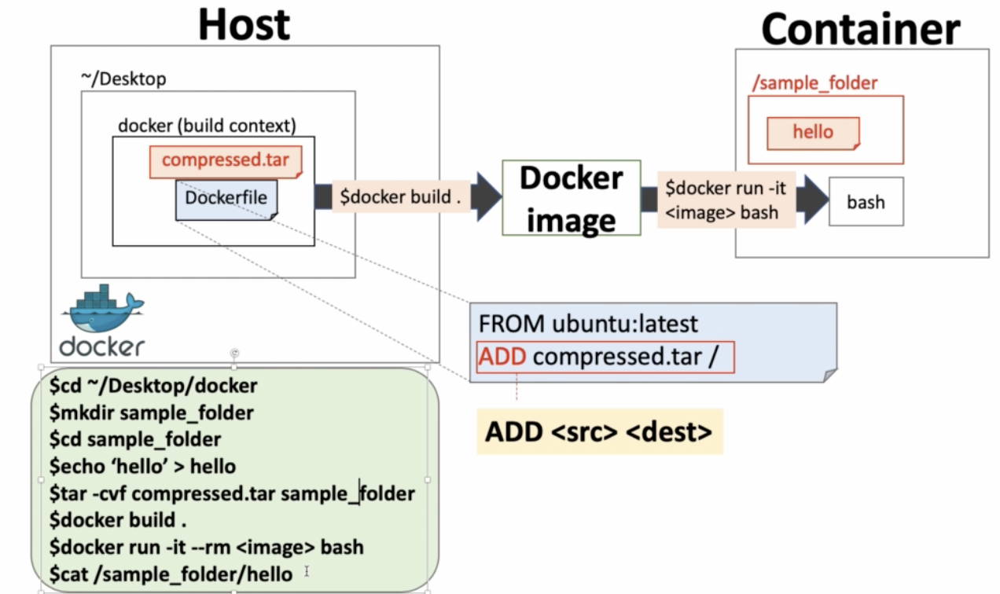
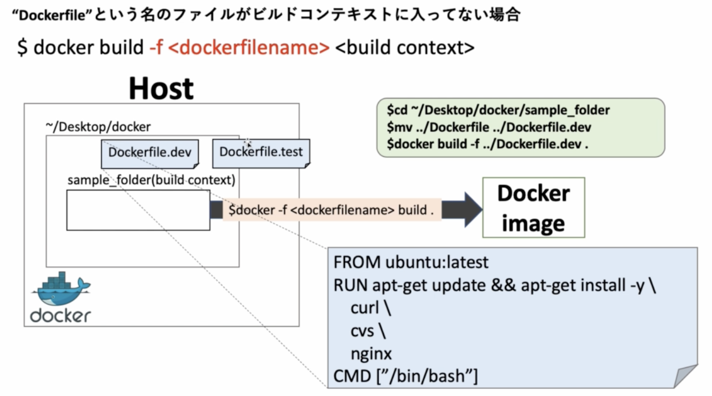
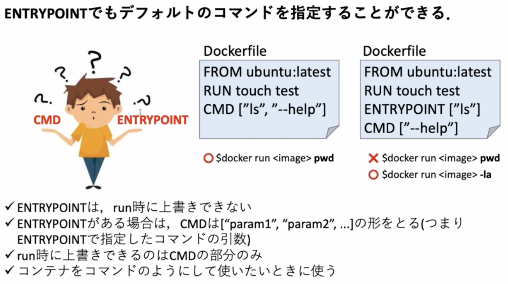
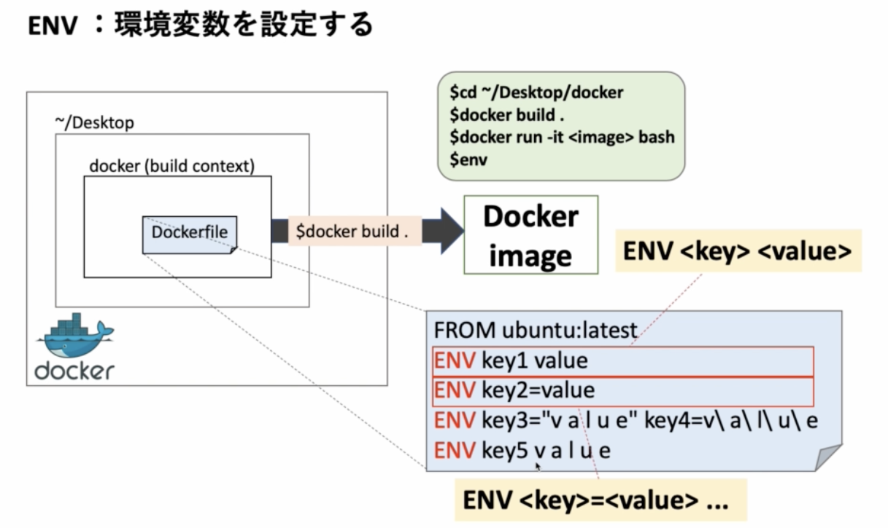
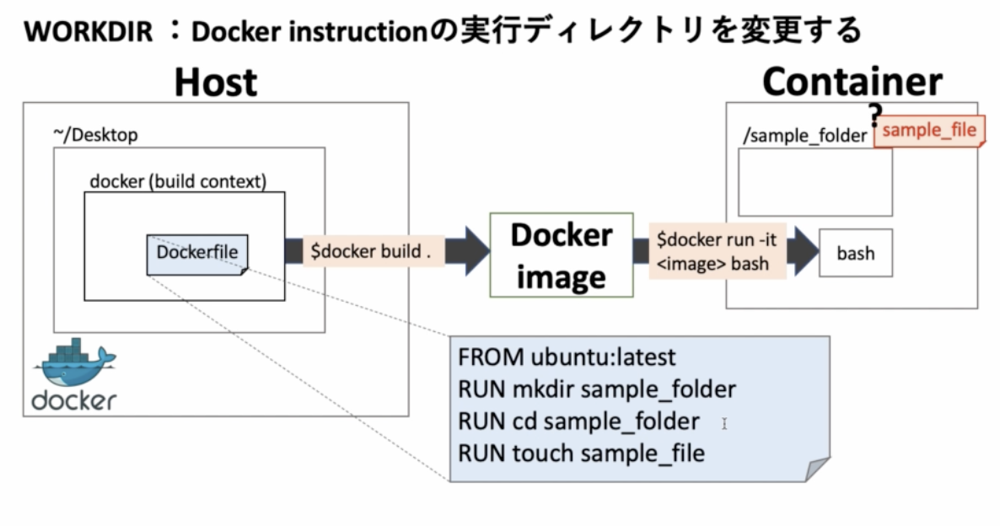
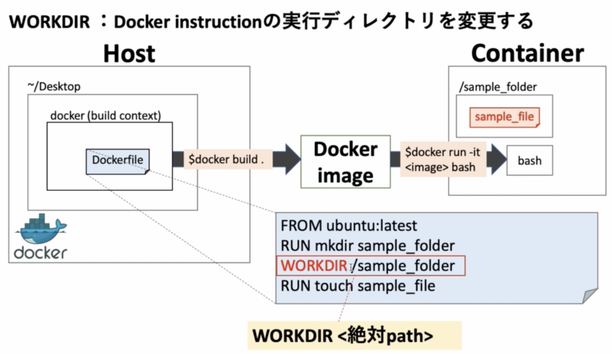
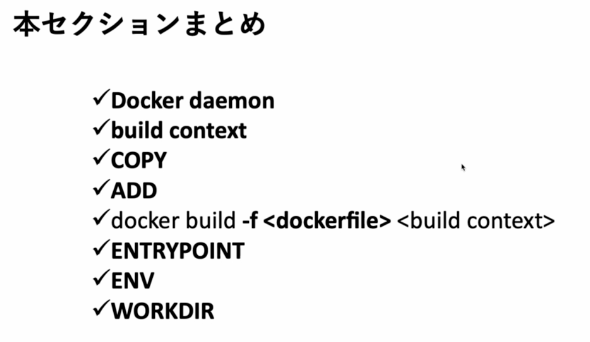

# docker build の詳細と、その他の instruction

## docker build は何をしているのか

docker build をすると Dockerfile のあるフォルダを build context として docker daemon に渡し、それをもとに image を作ってくれる。

## docker daemon

docker daemon は docker object(container, image, network, volume など)を管理していて、我々は docker CLI を用いて docker daemon とコミュニケーションを取っていた。

## build context

|
|:-:|

## COPY

|
|:-:|

build context の中にあるファイルを image の中に持っていける。  
Dockerfile の書き方は以下。

```Dockerfile
# src ... ファイルのこと？
# dest ... 階層
COPY <src> <dest>
```

/new_dir というディレクトリを作り、そこにホストにある something というファイルを image の中に持っていきたい。

Dockerfile 例  
どうやら `/new_dir` でも `new_dir` でもいけるみたいだが、絶対パスの書き方のほうが良さげらしい。

```Dockerfile
FROM ubuntu:latest
RUN mkdir /new_dir
COPY something /new_dir
```

docker build する

```sh
$ docker build .
[+] Building 2.4s (9/9) FINISHED
 => [internal] load build definition from Dockerfile
 => => transferring dockerfile: 104B
 => [internal] load .dockerignore
 => => transferring context: 2B
 => [internal] load metadata for docker.io/library/ubuntu:latest
 => [auth] library/ubuntu:pull token for registry-1.docker.io
 => CACHED [1/3] FROM docker.io/library/ubuntu:latest@sha256:669e010b58baf5beb2836b253c1fd5768333f0d1dbcb834f7c07a4dc93f474be
 => [internal] load build context
 => => transferring context: 30B
 => [2/3] RUN mkdir /new_dir
 => [3/3] COPY something /new_dir
 => exporting to image
 => => exporting layers
 => => writing image sha256:23aa3ebb74b05865e3e428cd47143547f3210623f3d870879ce68df9cd1492fe
```

コンテナを立てて中身を確認

```
$ docker run -it 23aa3ebb74b0 bash
root@54a67bcac53b:/# ls
bin  boot  dev  etc  home  lib  media  mnt  new_dir  opt  proc  root  run  sbin  srv  sys  tmp  usr  var
root@54a67bcac53b:/# ls /new_dir
something
```

## ADD vs COPY

- 単純にファイルやフォルダをコピーする場合は COPY
- tar の圧縮ファイルをコピーして解凍したいときは ADD

大きいファイルを image に入れたいとき、普通にファイルを build context に置いて COPY する場合、docker build 時に時間がかかってしまう。そういうときはファイルを圧縮しておいて ADD を使用する。
ADD は自動で解凍もしてくれる。

|
|:-:|

準備

```sh
$ mkdir sample_folder
$ cd sample_folder
$ echo "hello world" > hello
$ cd ..
$ tar -cvf sample.tar sample_folder
```

Dockerfile 準備

```Dockerfile
FROM ubuntu:latest
ADD sample.tar /
```

docker build

```
$ docker build .
[+] Building 2.4s (8/8) FINISHED
 => [internal] load build definition from Dockerfile
 => => transferring dockerfile: 78B
 => [internal] load .dockerignore
 => => transferring context: 2B
 => [internal] load metadata for docker.io/library/ubuntu:latest
 => [auth] library/ubuntu:pull token for registry-1.docker.io
 => [internal] load build context
 => => transferring context: 2.60kB
 => CACHED [1/2] FROM docker.io/library/ubuntu:latest@sha256:669e010b58baf5beb2836b253c1fd5768333f0d1dbcb834f7c07a4dc93f474be
 => [2/2] ADD sample.tar /
 => exporting to image
 => => exporting layers
 => => writing image sha256:18049651cb168b186afb3a04030fd215e448d8b5b735027abd57a4757dd1101c

Use 'docker scan' to run Snyk tests against images to find vulnerabilities and learn how to fix them
```

確認

```
$ docker run -it --rm 18049651cb168b186afb3a04030fd215e448d8b5b735027abd57a4757dd1101c bash
root@ea050b308d3c:/# cat /sample_folder/hello
hello world
root@ea050b308d3c:/# ls
bin  boot  dev  etc  home  lib  media  mnt  opt  proc  root  run  sample_folder  sbin  srv  sys  tmp  usr  var
root@ea050b308d3c:/# cd sample_folder/
root@ea050b308d3c:/sample_folder# ls
hello
```

## Dockerfile が build context にない場合

-f で Dockerfile を指定することはよくある。  
これにより Dockerfile と build context を分けて管理できる。

```
$ docker build -f <Dockerfile 名> <build context>
```

|
|:-:|

このように Dockerfile が複数存在し、開発用、テスト用、本番用などの Dockerfile があって使い分けたい場合は、-f で Dockerfile を指定して build してあげるケースがある。

準備

```sh
$ cd sample_folder
$ ls
hello
$ mv ../Dockerfile ../Dockerfile.dev
```

Dockerfile

```Dockerfile
FROM ubuntu:latest
RUN apt-get update && apt-get install -y \
    curl \
    cvs \
    nginx
CMD [ "/bin/bash" ]
```

docker build

```
$ docker build -f ../Dockerfile.dev .
[+] Building 2.1s (7/7) FINISHED
 => [internal] load build definition from Dockerfile.dev
 => => transferring dockerfile: 159B
 => [internal] load .dockerignore
 => => transferring context: 2B
 => [internal] load metadata for docker.io/library/ubuntu:latest
 => [auth] library/ubuntu:pull token for registry-1.docker.io
 => [1/2] FROM docker.io/library/ubuntu:latest@sha256:669e010b58baf5beb2836b253c1fd5768333f0d1dbcb834f7c07a4dc93f474be
 => CACHED [2/2] RUN apt-get update && apt-get install -y     curl     cvs     nginx
 => exporting to image
 => => exporting layers
 => => writing image sha256:0bb607faf74b7dccb45f64540044aa8847d21a2035d63b8126bc698e7646989e
```

## CMD vs ENTRYPOINT

ENTRYPOINT は run 時にコマンドの上書きができない。

左の場合 pwd が実行される

|
|:-:|

右のバツの場合 ls pwd となってエラー（CMD の部分が上書きされる）  
丸の場合 ls -la となり上書きできる。

コンテナをコマンドのように使いたいときに ENTRYPOINT

Dockerfile

```Dockerfile
FROM ubuntu:latest
RUN touch test
ENTRYPOINT [ "ls" ]
CMD [ "--help" ]
```

docker build

```sh
$ docker build .
[+] Building 0.1s (6/6) FINISHED
 => [internal] load build definition from Dockerfile
 => => transferring dockerfile: 113B
 => [internal] load .dockerignore
 => => transferring context: 2B
 => [internal] load metadata for docker.io/library/ubuntu:latest
 => [1/2] FROM docker.io/library/ubuntu:latest
 => CACHED [2/2] RUN touch test
 => exporting to image
 => => exporting layers
 => => writing image sha256:4cb89ef099e701d587c0fa057713a44db6200a200e7c15488bb0bd09fbeb1d88

Use 'docker scan' to run Snyk tests against images to find vulnerabilities and learn how to fix them
```

docker run

```sh
$ docker run 4cb89ef099e701d587c0fa057713a44db6200a200e7c15488bb0bd09fbeb1d88
Usage: ls [OPTION]... [FILE]...
List information about the FILEs (the current directory by default).
Sort entries alphabetically if none of -cftuvSUX nor --sort is specified.

Mandatory arguments to long options are mandatory for short options too.
  -a, --all                  do not ignore entries starting with .
  (省略)
```

コマンドの上書き

```sh
$ docker run 4cb89ef099e701d587c0fa057713a44db6200a200e7c15488bb0bd09fbeb1d88 -la
total 56
drwxr-xr-x   1 root root 4096 Feb 18 11:36 .
drwxr-xr-x   1 root root 4096 Feb 18 11:36 ..
-rwxr-xr-x   1 root root    0 Feb 18 11:36 .dockerenv
lrwxrwxrwx   1 root root    7 Jan 13 16:59 bin -> usr/bin
drwxr-xr-x   2 root root 4096 Apr 15  2020 boot
drwxr-xr-x   5 root root  340 Feb 18 11:36 dev
drwxr-xr-x   1 root root 4096 Feb 18 11:36 etc
drwxr-xr-x   2 root root 4096 Apr 15  2020 home
lrwxrwxrwx   1 root root    7 Jan 13 16:59 lib -> usr/lib
(省略)
```

CMD の部分だけ上書きされているのがわかる。

### ENV

環境変数を設定してくれる

|
|:-:|

PATH を通すときによく使うらしい。

Dockerfile

```Dockerfile
FROM ubuntu:latest
ENV key1 value
ENV key2=value
ENV key3="v a l u e" key4=v\ a\ l\ u\ e
ENV key5 v a l u e
```

基本的には key1 の書き方がいいらしい
複数書くのなら key2 のケースがいい

docker build

```sh
$ docker build .
[+] Building 0.1s (5/5) FINISHED
 => [internal] load build definition from Dockerfile
 => => transferring dockerfile: 150B
 => [internal] load .dockerignore
 => => transferring context: 2B
 => [internal] load metadata for docker.io/library/ubuntu:latest
 => CACHED [1/1] FROM docker.io/library/ubuntu:latest
 => exporting to image
 => => exporting layers
 => => writing image sha256:6eec21ce184d16a615dc2379c0f0d8725652311978a076a55e70e8ebb04278b3
```

docker run

```
$ docker run -it --rm 6eec21ce184d16a615dc2379c0f0d8725652311978a076a55e70e8ebb04278b3
root@8f720c932b47:/# env
HOSTNAME=8f720c932b47
PWD=/
HOME=/root
LS_COLORS=rs=0:di=01;34:ln=01;36:mh=00:pi=40;33:so=01;35:do=01;35:bd=40;33;01:cd=40;33;01:or=40;31;01:mi=00:su=37;41:sg=30;43:ca=30;41:tw=30;42:ow=34;42:st=37;44:ex=01;32:*.tar=01;31:*.tgz=01;31:*.arc=01;31:*.arj=01;31:*.taz=01;31:*.lha=01;31:*.lz4=01;31:*.lzh=01;31:*.lzma=01;31:*.tlz=01;31:*.txz=01;31:*.tzo=01;31:*.t7z=01;31:*.zip=01;31:*.z=01;31:*.dz=01;31:*.gz=01;31:*.lrz=01;31:*.lz=01;31:*.lzo=01;31:*.xz=01;31:*.zst=01;31:*.tzst=01;31:*.bz2=01;31:*.bz=01;31:*.tbz=01;31:*.tbz2=01;31:*.tz=01;31:*.deb=01;31:*.rpm=01;31:*.jar=01;31:*.war=01;31:*.ear=01;31:*.sar=01;31:*.rar=01;31:*.alz=01;31:*.ace=01;31:*.zoo=01;31:*.cpio=01;31:*.7z=01;31:*.rz=01;31:*.cab=01;31:*.wim=01;31:*.swm=01;31:*.dwm=01;31:*.esd=01;31:*.jpg=01;35:*.jpeg=01;35:*.mjpg=01;35:*.mjpeg=01;35:*.gif=01;35:*.bmp=01;35:*.pbm=01;35:*.pgm=01;35:*.ppm=01;35:*.tga=01;35:*.xbm=01;35:*.xpm=01;35:*.tif=01;35:*.tiff=01;35:*.png=01;35:*.svg=01;35:*.svgz=01;35:*.mng=01;35:*.pcx=01;35:*.mov=01;35:*.mpg=01;35:*.mpeg=01;35:*.m2v=01;35:*.mkv=01;35:*.webm=01;35:*.ogm=01;35:*.mp4=01;35:*.m4v=01;35:*.mp4v=01;35:*.vob=01;35:*.qt=01;35:*.nuv=01;35:*.wmv=01;35:*.asf=01;35:*.rm=01;35:*.rmvb=01;35:*.flc=01;35:*.avi=01;35:*.fli=01;35:*.flv=01;35:*.gl=01;35:*.dl=01;35:*.xcf=01;35:*.xwd=01;35:*.yuv=01;35:*.cgm=01;35:*.emf=01;35:*.ogv=01;35:*.ogx=01;35:*.aac=00;36:*.au=00;36:*.flac=00;36:*.m4a=00;36:*.mid=00;36:*.midi=00;36:*.mka=00;36:*.mp3=00;36:*.mpc=00;36:*.ogg=00;36:*.ra=00;36:*.wav=00;36:*.oga=00;36:*.opus=00;36:*.spx=00;36:*.xspf=00;36:
TERM=xterm
key4=v a l u e
key5=v a l u e
key2=value
key3=v a l u e
key1=value
SHLVL=1
PATH=/usr/local/sbin:/usr/local/bin:/usr/sbin:/usr/bin:/sbin:/bin
_=/usr/bin/env
```

env ですべての環境変数が見れる

## WORKDIR

Docker instruction の実行ディレクトリを変更する。

|
|:-:|

基本的に RUN のコマンドはルート直下で実行される。

Dockerfile

```Dockerfile
FROM ubuntu:latest
RUN mkdir sample
RUN cd sample
RUN touch test
```

docker build

```sh
$ docker build .
[+] Building 0.7s (8/8) FINISHED
 => [internal] load build definition from Dockerfile
 => => transferring dockerfile: 107B
 => [internal] load .dockerignore
 => => transferring context: 2B
 => [internal] load metadata for docker.io/library/ubuntu:latest
 => CACHED [1/4] FROM docker.io/library/ubuntu:latest
 => [2/4] RUN mkdir sample
 => [3/4] RUN cd sample
 => [4/4] RUN touch test
 => exporting to image
 => => exporting layers
 => => writing image sha256:017a2bc2b7093240afb70bf3bda0bb83b56f44068ef99924c54cf3ecd83b5962
```

```
$ docker run -it --rm 017a2bc2b7093240afb70bf3bda0bb83b56f44068ef99924c54cf3ecd83b5962 bash
root@1c6413447678:/# ls
bin  boot  dev  etc  home  lib  media  mnt  opt  proc  root  run  sample  sbin  srv  sys  test  tmp  usr  var
root@1c6413447678:/# ls sample/
root@1c6413447678:/#
```

ちなみにこの書き方だと、ちゃんと sample フォルダにて test ファイルが作られる。

```Dockerfile
FROM ubuntu:latest
RUN mkdir sample && cd sample && touch test
```

|
|:-:|

WORKDIR を使った書き方。  
WORKDIR <絶対 path> で絶対 path を指定してやるのが良い

```Dockerfile
FROM ubuntu:latest
RUN mkdir sample
WORKDIR /sample
RUN touch test
```

docker build

```sh
$ docker build .
[+] Building 0.3s (8/8) FINISHED
 => [internal] load build definition from Dockerfile
 => => transferring dockerfile: 110B
 => [internal] load .dockerignore
 => => transferring context: 2B
 => [internal] load metadata for docker.io/library/ubuntu:latest
 => [1/4] FROM docker.io/library/ubuntu:latest
 => CACHED [2/4] RUN mkdir sample
 => [3/4] WORKDIR /sample
 => [4/4] RUN touch test
 => exporting to image
 => => exporting layers
 => => writing image sha256:c21f80823323123b7aec8d3ce9d2eea221414e4cb8f83521a3b190daa6e5c7ec

Use 'docker scan' to run Snyk tests against images to find vulnerabilities and learn how to fix them
```

```
docker run -it --rm c21f80823323123b7aec8d3ce9d2eea221414e4cb8f83521a3b190daa6e5c7ec bash
root@71e944aaa71c:/sample# ls
test
root@71e944aaa71c:/sample# cd ..
root@71e944aaa71c:/# ls
bin  boot  dev  etc  home  lib  media  mnt  opt  proc  root  run  sample  sbin  srv  sys  tmp  usr  var
```

実は mkdir しなくても良い。  
WORKDIR で指定したフォルダがなければ勝手に作ってくれる。

```dockerfile
FROM ubuntu:latest
WORKDIR /sample
RUN touch test
```

## まとめ

|
|:-:|
