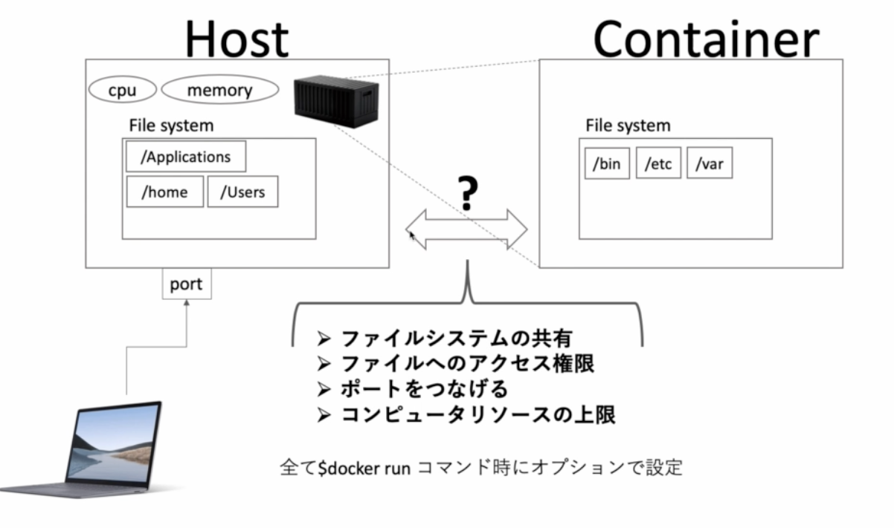
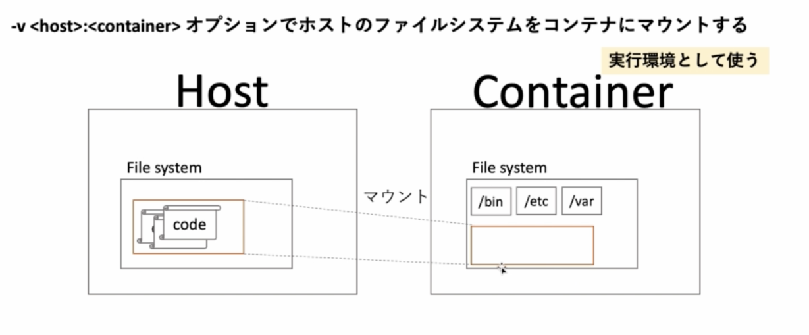
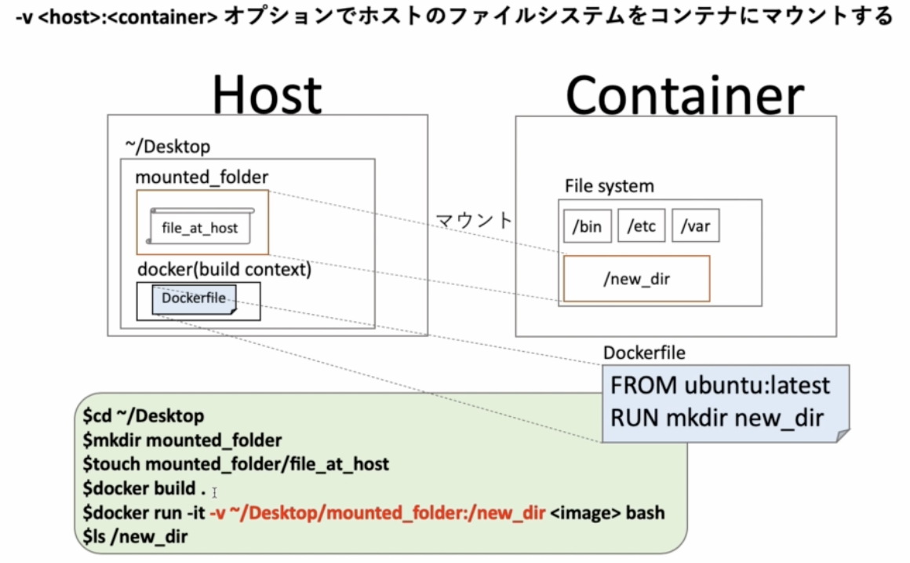
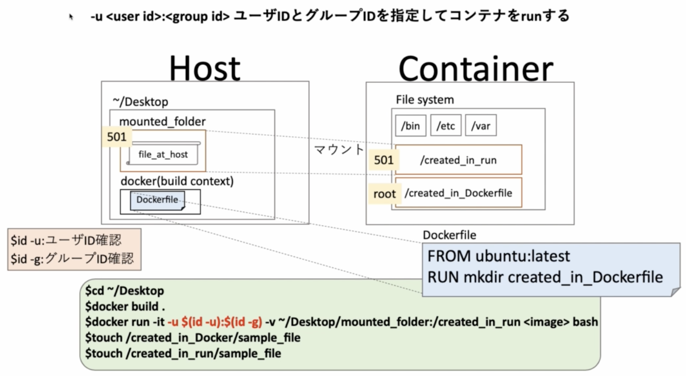
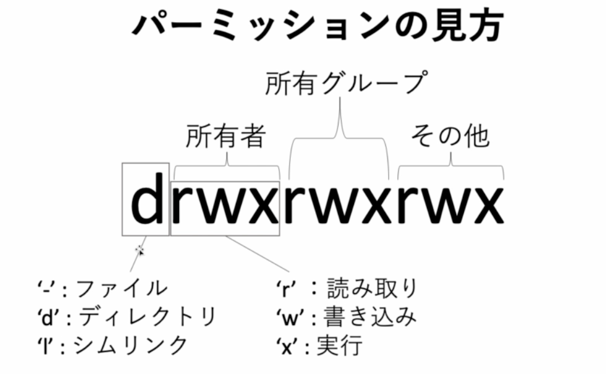
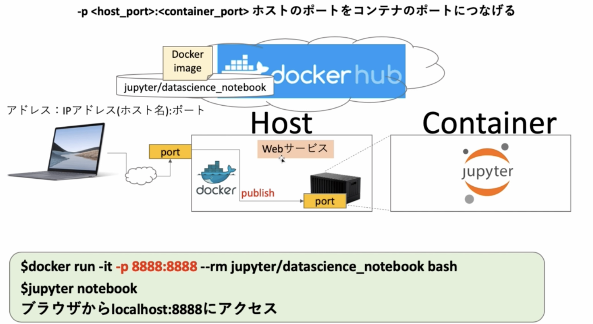
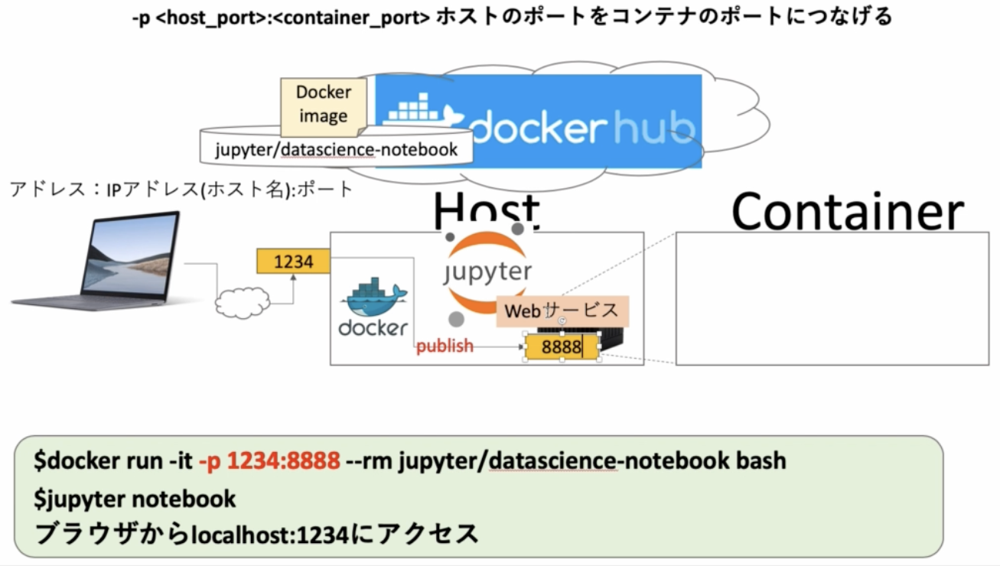
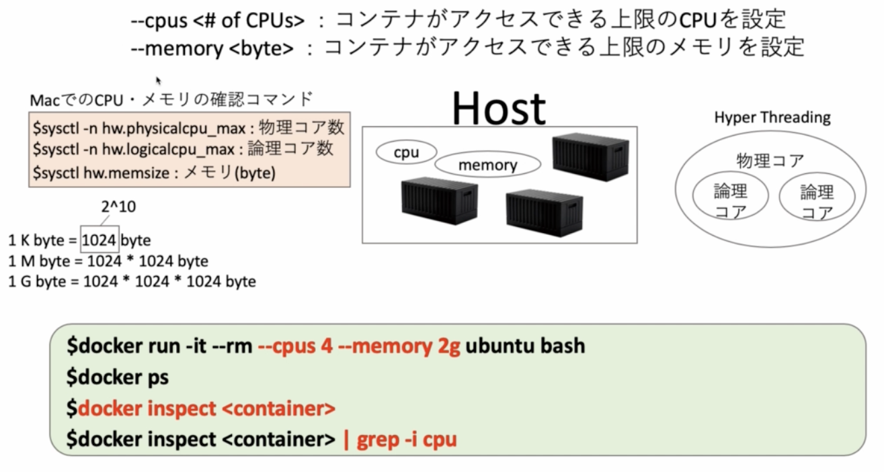
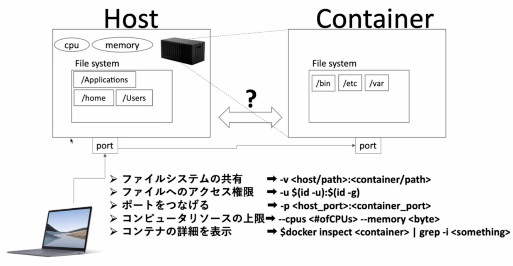

# ホストとコンテナの関係性

## 概要

|
|:-:|

## -v オプションでファイルシステムを共有

### -v <host のパス>:<コンテナのパス>

超よく使う

|
|:-:|

コードを host 側においておいて、コードを実行する際にコンテナを使う際に、使う。  
もしコンテナ側にコードを置くとなると、コンテナがでかくなってしまう。

|
|:-:|

準備

```sh
$ mkdir mounted
$ touch mounted/sample
$ ls mounted
sample
$
```

Dockerfile

```Dockerfile
FROM ubuntu:latest
RUN mkdir new
```

docker build . して run

```
$ docker build .

$ docker run -it -v ~/github/docker-practice/09/mounted:/new 73bbc3b6c3d5b6cbdef bash
root@58b4757cab76:/# ls
bin  boot  dev  etc  home  lib  media  mnt  new  opt  proc  root  run  sbin  srv  sys  tmp  usr  var
root@58b4757cab76:/# ls new
sample
root@58b4757cab76:/# cat new/sample
root@58b4757cab76:/#
```

host にある monted の sample ファイルに `testtest` と記載してみる。

再び cat してみると更新されている。

```
root@58b4757cab76:/# cat new/sample
testtest
```

実はコンテナに指定するフォルダがなくても勝手に作ってくれる

new_dummy という名前にして試してみる

```
$ docker run -it -v ~/github/docker-practice/09/mounted:/new_dummy 73bbc3b6c3d5b6cbdef bash
root@95fbee585006:/# ls
bin  boot  dev  etc  home  lib  media  mnt  new  new_dummy  opt  proc  root  run  sbin  srv  sys  tmp  usr  var
root@95fbee585006:/# cat new_dummy/sample
testtest
```

## -u オプションでホストとコンテナのアクセス権限を共有する

|
|:-:|

```sh
$ id -u
501
$ id -g
20
```

```Dockerfile
FROM ubuntu:latest
RUN mkdir created-in-dockerfile
```

docker build して run

```sh
$ docker run -it -u $(id -u):$(id -g) -v ~/github/docker-practice/09/mounted:/created-in-run 361bc5b5ecfa52a24 bash
I have no name!@61044b691291:/$ ls
bin  boot  created-in-dockerfile  created-in-run  dev  etc  home  lib  media  mnt  opt  proc  root  run  sbin  srv  sys  tmp  usr  var

```

`I have no name` は userid は共有されているが username は共有されていないため、名前がないと言われているだけ

以下で権限確認する  
ちなみになぜか知らないが、初回の `ls -la` では root のままである。  
いったん `ls -la created-in-run/` で 501 になっているのを確認してから ls -la とすると 501 に変わっている

```
I have no name!@61044b691291:/$ ls -la
total 60
drwxr-xr-x   1 root root    4096 Feb 23 03:20 .
drwxr-xr-x   1 root root    4096 Feb 23 03:20 ..
-rwxr-xr-x   1 root root       0 Feb 23 03:20 .dockerenv
lrwxrwxrwx   1 root root       7 Jan 13 16:59 bin -> usr/bin
drwxr-xr-x   2 root root    4096 Apr 15  2020 boot
drwxr-xr-x   2 root root    4096 Feb 23 03:17 created-in-dockerfile
drwxr-xr-x   3  501 dialout   96 Feb 23 01:46 created-in-run
drwxr-xr-x   5 root root     360 Feb 23 03:20 dev
drwxr-xr-x   1 root root    4096 Feb 23 03:20 etc
drwxr-xr-x   2 root root    4096 Apr 15  2020 home
lrwxrwxrwx   1 root root       7 Jan 13 16:59 lib -> usr/lib
drwxr-xr-x   2 root root    4096 Jan 13 16:59 media
drwxr-xr-x   2 root root    4096 Jan 13 16:59 mnt
drwxr-xr-x   2 root root    4096 Jan 13 16:59 opt
dr-xr-xr-x 223 root root       0 Feb 23 03:20 proc
drwx------   2 root root    4096 Jan 13 17:18 root
drwxr-xr-x   5 root root    4096 Jan 13 17:18 run
lrwxrwxrwx   1 root root       8 Jan 13 16:59 sbin -> usr/sbin
drwxr-xr-x   2 root root    4096 Jan 13 16:59 srv
dr-xr-xr-x  13 root root       0 Feb 23 03:20 sys
drwxrwxrwt   2 root root    4096 Jan 13 17:18 tmp
drwxr-xr-x  10 root root    4096 Jan 13 16:59 usr
drwxr-xr-x  11 root root    4096 Jan 13 17:18 var
```

左にある謎の記号についての説明

|
|:-:|

created-in-dockerfile は root が所有者で、 root が所有グループ
created-in-run は 501 が所有者で、 dialout が所有グループ

```
I have no name!@61044b691291:/$ cd created-in-dockerfile/
I have no name!@61044b691291:/created-in-dockerfile$ touch test
touch: cannot touch 'test': Permission denied
I have no name!@61044b691291:/created-in-dockerfile$ cd ../created-in-run/
I have no name!@61044b691291:/created-in-run$ touch test
I have no name!@61044b691291:/created-in-run$ ls
sample  test
```

よって、created-in-dockerfile では、現在 id:501 で入っていてその他の扱いのため、書き込みの権限がない。よって、`touch test` はできない  
一方、created-in-run では 501 は所有者の扱いのため `touch test` ができる

## -p でホストとコンテナのポートをつなげる

### -p <host のポート>:<コンテナのポート> ホストのポートをコンテナのポートに繋げる

|
|:-:|

※今回は外部の PC から Host につなげるのではなく、自分の PC からつなげていることに注意

サーバーに複数の web サービスが有る場合、どのサービスにアクセスするか、ということのためにポートが必要

IP:住所  
port:部屋番号  
みたいな

コンテナに web サービスを立てた場合、host のポートからコンテナのポートにつなげるために -p が必要

```
$ docker run -it -p 8888:8888 --rm jupyter/datascience-notebook bash
```

```
$ jupyter notebook
```

localhost:8888 をブラウザで打てば、jupyter notebook が開く

ちなみにこのようにポートを変えてもできる。  
後半の 8888 は jupyter notebook のデフォルトのポートなので変えられない。
docker run -it -p 1234:8888 --rm jupyter/datascience-notebook bash
localhost:1234

|
|:-:|

## コンテナで使えるコンピュータリソースの上限を設定する

|
|:-:|

OOM やメモリリークを防ぐ

自分の PC の CPU、メモリを確認

```sh
$ sysctl -n hw.physicalcpu_max
8
$ sysctl -n hw.logicalcpu_max
8
$ sysctl hw.memsize
hw.memsize: 8589934592
```

cpu とメモリを指定して docker run

```sh
$ docker run -it --rm --cpus 4 --memory 2g ubuntu bash
```

```sh
docker ps
CONTAINER ID   IMAGE     COMMAND   CREATED          STATUS         PORTS    NAMES
6d230b0dc61e   ubuntu    "bash"    11 seconds ago   Up 9 seconds            sweet_wilson

$ docker inspect 6d230b0dc61e

# cpu を絞ってみる
$ docker inspect 6d230b0dc61e | grep -i cpu
            "CpuShares": 0,
            "NanoCpus": 4000000000,
            "CpuPeriod": 0,
            "CpuQuota": 0,
            "CpuRealtimePeriod": 0,
            "CpuRealtimeRuntime": 0,
            "CpusetCpus": "",
            "CpusetMems": "",
            "CpuCount": 0,
            "CpuPercent": 0,

# memory を絞って見る
$ docker inspect 6d230b0dc61e | grep -i memory
            "Memory": 2147483648,
            "KernelMemory": 0,
            "KernelMemoryTCP": 0,
            "MemoryReservation": 0,
            "MemorySwap": 4294967296,
            "MemorySwappiness": null,
```


## まとめ

|
|:-:|
